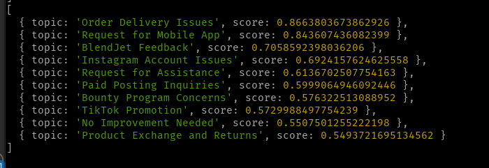

# vector-2-trend

Take (text) vectors and get out trending topics using clustering algorithms.

```
npm i vector-2-trend
```

Good use cases:

- surfacing topics in user feedback
- categorizing survey responses


## Summary

You have some semantic vectors for text and would like to show trending topics, yes? Of course you do, it's a common use case. It's a few steps to do this however. Generally it involves clustering, and then summarizing the clusters somehow. This module helps you do that (I developed this code while working on an experiment called saymore.ai).

For clustering we use `kmeans` but will be adding more algorithms.

For classification, we use GPT-3.5-turbo using openai API (just use the API key).

## Interface

### The format of the Vectors:

```typescript
import { DataPoint } from 'vector-2-trend'

interface DataPoint {
    id: number | string
    text: string,
    vector: number[]
}

const vectors: DataPoint[] = [{
    id: 'abc-123',
    text: 'some text',
    vector: [0, 1, 2, 3 ... n]
}]
```

### Clustering the vectors:

```typescript
import Vector2Trend, {
  ClusteringArgument,
  ClusteringResult,
} from 'vector-2-trend';

type ClusteringArgument = {
  records: DataPoint[];
  n: number;
  pcaDimensions: number;
  // we will add more in the future
  clusteringAlgorithm: 'kmeans';
};

const clusteringResult: ClusteringResult = Vector2Trend.cluster({
  vectors: vectors,
  // Dimensionality of the vectors - any number, but make sure they are uniform
  // 1536 is the dimensionality of the text-embedding-ada-002 model by openAI 
  // which is cheap and performant (3k pages per dollar in 2023)
  n: 1536,
  // tune this based on your own data
  // if you make this the same number as N PCA will essentially be skipped
  // but with high dimensional data I would recommend a number that is reasonable
  // for performance considerations.
  pcaDimensions: 10,
  // algorithm
  clusteringAlgorithm: 'kmeans',
});
```

### Classifying the vectors:

```typescript
import { ClassifiedClusterResponse } from 'vector-2-trend';

const classificationResult: ClassifiedClusterResponse[] = Vector2Trend.classify(
  {
    openAiApiKey: string,
    clusteringResult: ClusteringResult,
    nTopics: 10, // optional, defaults to 10. How many topics to try to categorize in GPT.
    temperature: 0.1, // optional, defaults to 0.1
    elementsPerGroup: 10, // optional defaults to 10 in case you have very large clusters & hit token limit
  },
);
```

### Using the results:

```typescript

// the type returned
export type ClassifiedClusterResponse = {
  // this is the density score
  score: number;

  // these are the same as from the cluster ranking result
  clusterId: number;
  count: number;
  records: DataPoint[];

  // generated from GPT
  name: string;
};


const classificationResults: ClassifiedClusterResponse[] =  [] /// see above - call Vector2Trend.classify

console.log(classificationResults.map(x => ({ topic: x.name, score: x.score })))

```

Would look something like this:



### Debugging / Logging

If something is going wrong with classification you can toggle on debug logging

```typescript
Vector2Trend.enableLogging();
```

## Developing

I will take PRs, just please make sure to add tests where you change functionality.

Jest tests are configured. 

```
npm run test
```

### Demo script

You can run the demo script locally, just change the openAI Api key.
```
npm run demo
```

The demo output should look like this:


## Your feedback

I am looking for you feedback to see what this could evolve into! Some things I have considered:

- adding in features to do initial vectorization
- graphical output features
- many more ways to tweak and use the clustering algorithm.
- more & better tests