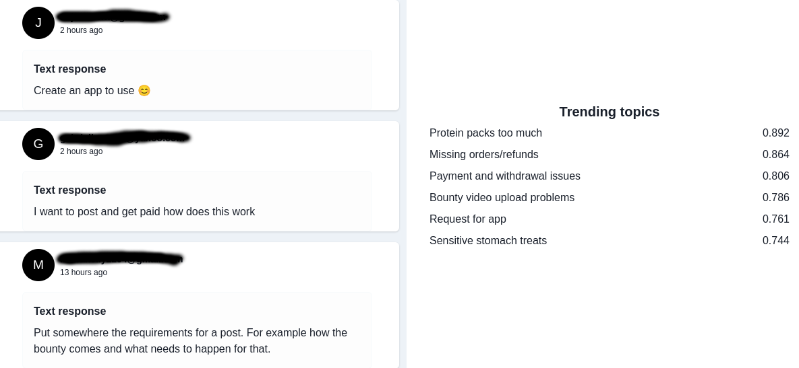

# vector-2-trend

Take (text) vectors and get out trending topics using clustering algorithms.



## Summary

You have some semantic vectors for text and would like to show trending topics, yes? Of course you do, it's a common use case. It's a few steps to do this however. Generally it involves clustering, and then summarizing the clusters somehow. This module helps you do that (I developed this code while working on an experiment called saymore.ai).

For clustering we use `kmeans` but will be adding more algorithms.

For classification, we use GPT-3.5-turbo using openai API (just use the API key).

## Interface

### The format of the Vectors:

```typescript
import { DataPoint } from 'vector-2-trend'

interface DataPoint {
    id: number | string
    text: string,
    vector: number[]
}

const vectors: DataPoint[] = [{
    id: 'abc-123',
    text: 'some text',
    vector: [0, 1, 2, 3 ... n]
}]
```

### Clustering the vectors:

```typescript
import Vector2Trend, {
  ClusteringArgument,
  ClusteringResult,
} from 'vector-2-trend';

type ClusteringArgument = {
  records: DataPoint[];
  n: number;
  pcaDimensions: number;
  // we will add more in the future
  clusteringAlgorithm: 'kmeans';
};

const clusteringResult: ClusteringResult = Vector2Trend.cluster({
  vectors: vectors,
  // any number, but make sure they are uniform
  n: 1536,
  // tune this based on your own data
  // if you make this the same number as N PCA will be skipped
  pcaDimensions: 10,
  // algorithm
  clusteringAlgorithm: 'kmeans',
});
```

### Classifying the vectors:

```typescript
import { ClassifiedClusterResponse } from 'vector-2-trend';

const classificationResult: ClassifiedClusterResponse[] = Vector2Trend.classify(
  {
    openAiApiKey: string,
    clusteringResult: ClusteringResult,
  },
);
```

### Logging

If something is going wrong with classification you can toggle on debug logging

```typescript
Vector2Trend.enableLogging();
```
